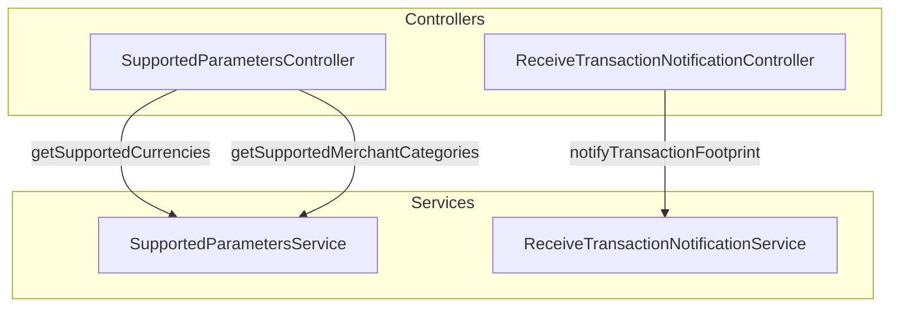

```mermaid

flowchart TD
    subgraph Controllers
        SPC[SupportedParametersController]
        RTNC[ReceiveTransactionNotificationController]
    end

    subgraph Services
        SPS[SupportedParametersService]
        RTNS[ReceiveTransactionNotificationService]
    end

    SPC -->|getSupportedCurrencies| SPS
    SPC -->|getSupportedMerchantCategories| SPS
    RTNC -->|notifyTransactionFootprint| RTNS

```
