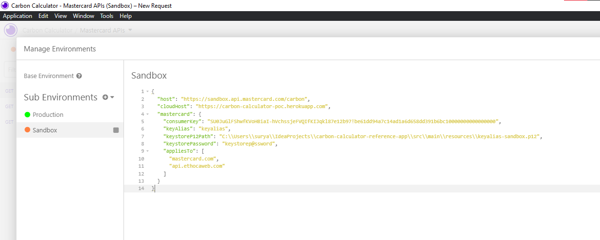
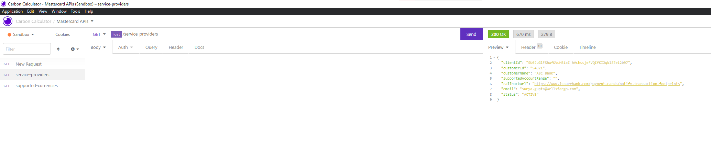
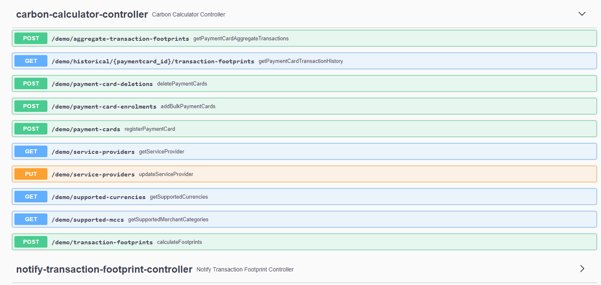

API Reference : https://developer.mastercard.com/carbon-calculator/documentation/api-reference/

Insomnia MasterCard Plug-in https://insomnia.rest/plugins/insomnia-plugin-mastercard

```
{
	"host": "https://sandbox.api.mastercard.com/carbon",
	"cloudHost": "https://carbon-calculator-poc.herokuapp.com",
	"mastercard": {
		"consumerKey": "SU0JuGlFShwfKVoHBiaI-hVchssjeFVQIfKIJqkl87e12b97!be61dd94a7c14ad1a6d658dd391b6bc10000000000000000",
		"keyAlias": "keyalias",
		"keystoreP12Path": "C:\\Users\\surya\\IdeaProjects\\carbon-calculator-reference-app\\src\\main\\resources\\keyalias-sandbox.p12",
		"keystorePassword": "keystorep@ssword",
		"appliesTo": [
			"mastercard.com",
			"api.ethocaweb.com"
		]
	}
}
```


Swagger URL: https://carbon-calculator-poc.herokuapp.com/swagger-ui/#/

